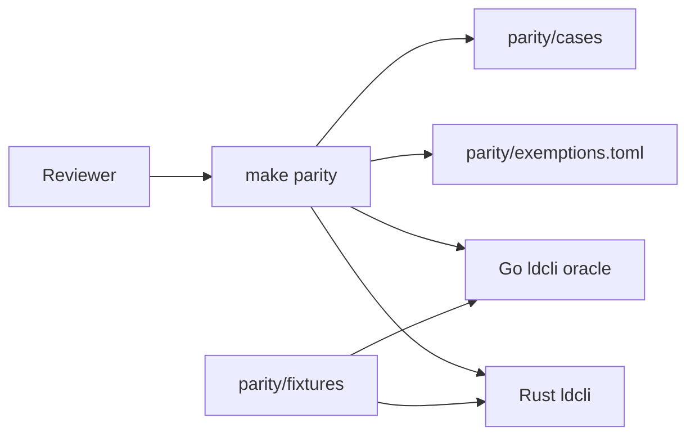
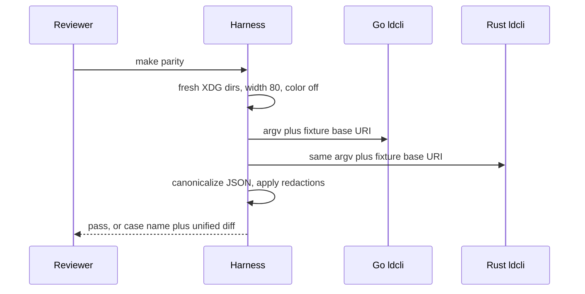
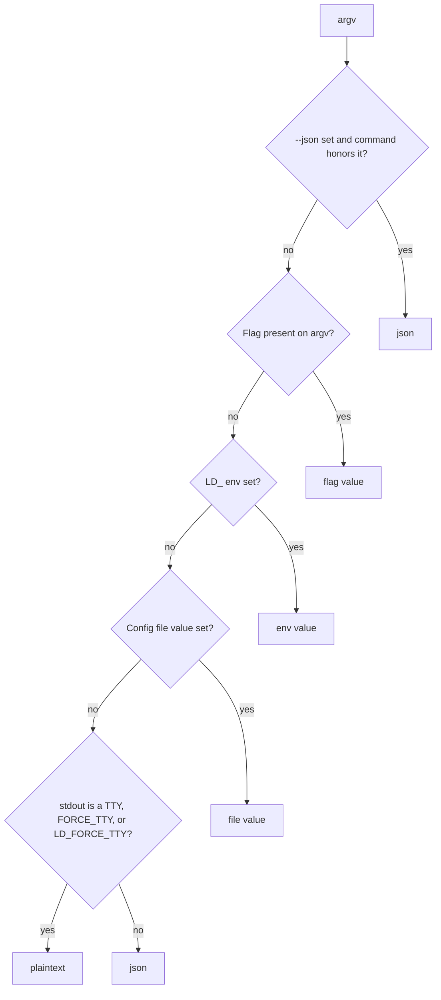
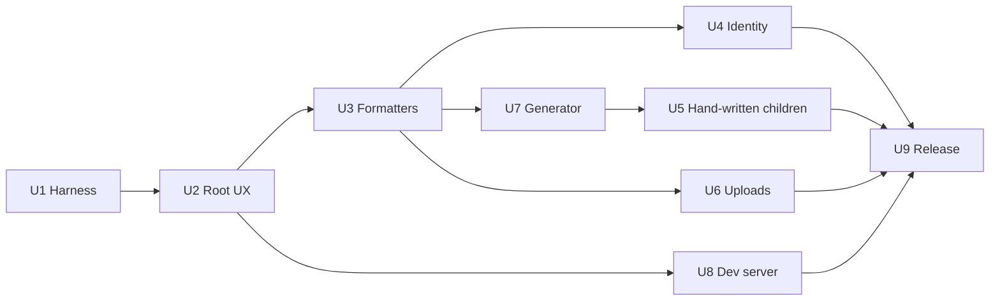

# Go to Rust CLI Migration - Plan

## Goal Capsule

- **Objective:** Ship a Rust `ldcli` that matches the current Go CLI's commands, configuration, and user-visible behavior, and give reviewers one command that diffs the two binaries. Completion script bytes, raw setup and quickstart frames, live analytics posts, and the long-running `dev-server start` process stay on the exemptions in Scope Boundaries. R13 is proved by the analytics property-map unit test.
- **Authority:** Product Contract requirements win on behavior. Key Technical Decisions win on mechanism inside those requirements. When this plan is silent, observed behavior of the Go CLI in this repo wins. A Rust-only cleanup of a Go quirk is a behavior change and stops the unit.
- **Execution profile:** Characterization first. Record Go behavior before expecting the Rust binary to pass. Each later unit extends the same corpus.
- **Stop conditions:** Do not delete the Go sources in these units. Do not publish Rust artifacts while an in-scope corpus tier is failing. Do not change Go output to make the diff pass. Do not commit a real access token, device code, or user code under `parity/`. Do not move floating release tags before the release archive itself has passed the harness.
- **Tail ownership:** The implementer owns `rust/`, `parity/`, and the release-workflow edits in U9. U9 replaces published artifacts. The Go tree stays the R1 parity oracle until the deferred deletion, after a shipped Rust release whose harness has stayed green.

---

## Product Contract

### Summary

Replace the Go LaunchDarkly CLI with a Rust CLI that users invoke the same way, and prove that match with a transcript diff against the Go binary. Completion script bytes, raw setup and quickstart frames, live analytics posts, and the long-running `dev-server start` process are exemptions. R13 is a unit test of the analytics property map. The plan covers the command surface, the local dev server, and the current release channels. It stops when that diff is green and the published `ldcli` binary is the Rust build.

### Problem Frame

`ldcli` is a Cobra/Viper CLI. Resource commands are generated from `ld-openapi.json`. The dev server embeds a React UI and SQLite. Releases ship through GitHub, npm, Homebrew, and Docker. A language move that is checked by reading help text or a feature checklist will miss flag precedence, error wording, and generated commands. Reviewers need a mechanical pass/fail they can re-run.

### Key Decisions

- Observable Go behavior is the product, including quirks. Governs R5, R6, R7, R8, R9, R10, R12, R18, R19.
- A failing transcript diff is a failed requirement. A prose checklist does not replace it. Governs R1, R2, R3, R4.

### Requirements

**Parity proof**

- R1. A reviewer runs one command that executes the same argv against the Go `ldcli` binary and the Rust `ldcli` binary and prints a unified diff of exit code, stdout, stderr, and declared filesystem side effects.
- R2. Each case uses a fresh config directory and a fresh state directory, pins terminal width to 80, disables color, sets the version label to `test` unless the case is about version or update checks, and opts out of the update check unless the case is about that notice.
- R3. JSON values on stdout and stderr are compared after key-stable canonicalization. Help wording, flag names, error sentences, and exit codes are compared as text. Version strings, timestamps, temp paths, UUIDs, hostnames, update-check notice lines, and the signup browser-failure warning line are redacted.
- R4. The harness fails when a command registered by the Go binary has neither a help transcript nor an entry in the exemption list. Every exemption names the substitute assertion that still runs.

**Command UX**

- R5. The Rust binary serves the same command tree, flag names, and help sections as the Go CLI. That includes the hand-maintained root usage list, required versus optional flag sections, dev-server command groups, hidden commands, and auth-exempt commands.
- R6. Usage errors and runtime errors exit 1 and do not print usage. Help and version exit 0. Success exits 0.
- R7. Precedence is an explicit flag, then an `LD_` environment variable with hyphens turned into underscores, then the config file, then the TTY default. `--json` overrides `--output` on commands that honor it in Go. `ldcli config` keeps ignoring `--json`. `LD_JSON` has no effect.
- R8. The config file path is `$XDG_CONFIG_HOME/ldcli/config.yml`, or `~/.config/ldcli/config.yml` when `XDG_CONFIG_HOME` is unset, on every operating system.

**Behavior**

- R9. Authenticated commands send the same request headers and render json, plaintext, and markdown, including `--fields`, with the same success and error text as the Go CLI. Dev-server commands that print raw response bodies keep doing that.
- R10. Resource commands are generated from `ld-openapi.json`. Generated command names, flag names, camelCase query parameters, semantic-patch requests, and synthesized empty DELETE bodies match the Go generator.
- R11. Login, signup, setup, and quickstart have non-interactive harness substitutes. The substitutes cover exit codes, user-visible messages, and config writes. Raw TUI frames and live browser launches are exemptions under R4.
- R12. The dev server keeps the current HTTP routes, the SQLite files under the XDG state directory, and the embedded React UI from `internal/dev_server/ui`.
- R13. When analytics is enabled, event names and property keys match the Go CLI, including agent detection. The dual-binary harness does not post those events. The unit test compares the property map and does not record the access token or `Authorization` header.

**Distribution**

- R14. Published archives keep the name pattern `ldcli_{version}_{platform}_{arch}.tar.gz` consumed by `package.json`. The binary inside is named `ldcli`. Docker images stay on `launchdarkly/ldcli`. Existing `config.yml` files keep loading.
- R15. The release gate runs the harness on the `ldcli` binary extracted from `ldcli_{version}_linux_amd64.tar.gz` produced by that release's goreleaser run. A reviewer accepts an installed artifact when its checksum matches the attested checksum file, its provenance matches `PROVENANCE.md`, and `ldcli --version` prints the release tag.
- R16. A bad release returns floating channels to the last published Go artifacts. Those channels are the Docker `latest` and `v{major}` tags, the npm `latest` dist-tag, and the Homebrew formula on `launchdarkly/homebrew-tap`. The Rust version's GitHub assets stay as history. Config and SQLite files stay readable by that Go binary with no rewrite.
- R17. Before the harness writes or diffs stdout, stderr, argv, filesystem snapshots, or fixtures, it substitutes access tokens, device codes, user codes, and verification URIs with stable placeholders. `config --list` is compared to Go's `[REDACTED]` text. The harness unsets `LD_ACCESS_TOKEN` and uses a synthetic token minted for the case. Analytics bodies and `Authorization` values are not written under `parity/`.
- R18. A command that does not change config leaves `config.yml` bytes unchanged. Startup creates the file only when the path is absent. Invalid YAML fails with the Go error and does not replace the file. A successful config write or login token save publishes one complete document by renaming a temp file over `config.yml`. A failed write leaves the previous bytes intact. Field parsing matches `internal/config/config.go`.
- R19. The dev server opens `dev_server.db` and `dev_server_events.db` in place at the same `xdg.StateFile` paths the Go server uses, including when `XDG_STATE_HOME` is unset. Open does not change journal mode and does not replace the file when it fails. After a successful open, the Go binary still reads the same rows. `foreign_keys` stays off for `dev_server.db` and on for `dev_server_events.db`, matching the Go server.

### Actors

- A1. A person or script that runs `ldcli` with the same flags they use today.
- A2. A reviewer who proves parity by re-running the harness and reading diffs.
- A3. A release workflow that publishes npm, Homebrew, Docker, and GitHub artifacts.

### Key Flows

- F1. Reviewer proof
  - **Trigger:** A2 wants to know whether the Rust CLI matches Go.
  - **Actors:** A2
  - **Steps:** Run the harness. Read a failing case as argv plus a unified diff, or read a coverage report where every Go command is either covered or exempt.
  - **Covered by:** R1, R2, R3, R4
- F2. Everyday invocation
  - **Trigger:** A1 runs a command with flags, environment, or a config file.
  - **Actors:** A1
  - **Steps:** The Rust binary resolves the same inputs as Go, calls the same API shape, and prints the same streams and exit code.
  - **Covered by:** R5, R6, R7, R8, R9, R10
- F3. Release cutover
  - **Trigger:** The in-scope corpus is green on the release archive, and the last Go release's artifacts are still downloadable.
  - **Actors:** A3, A2, A1
  - **Steps:** Record the last Go tag and its artifact coordinates. Build one goreleaser matrix into a draft release. Run the harness on the extracted linux/amd64 archive binary. Move floating Docker tags, the Homebrew formula, npm `latest`, and the GitHub draft to public only after checksums match and the R16 config and SQLite round-trip has passed. On a bad release, point those floating channels back at the recorded Go artifacts.
  - **Covered by:** R12, R14, R15, R16

### Acceptance Examples

- AE1. Help match. Covers R1, R3, R5, R6.
  - **Given:** Width 80 and color disabled.
  - **When:** Both binaries run `ldcli flags --help`.
  - **Then:** Exit code is 0 and stdout matches.
- AE2. Precedence. Covers R7.
  - **Given:** Config file `output: markdown`, environment `LD_OUTPUT=json`, and argv `--output plaintext` on a command that honors `--output`.
  - **When:** Both binaries run that argv.
  - **Then:** Both print plaintext.
- AE3. Missing flag. Covers R6.
  - **Given:** A command with a required flag.
  - **When:** Both binaries run it without that flag.
  - **Then:** Exit code is 1, stdout is empty, stderr matches, and usage is absent.
- AE4. Config location and redaction. Covers R8, R9, R17, R18.
  - **Given:** `XDG_CONFIG_HOME` points at an empty temp directory and the harness has minted a synthetic token.
  - **When:** Both binaries run `config --set access-token` with that token against a fixture that accepts it, then `config --list`.
  - **Then:** The token is written only under that temp directory during the run. Committed files store the placeholder. List output shows `[REDACTED]` and does not contain the token.
- AE5. Generated list. Covers R9, R10.
  - **Given:** A fixture HTTP response for one generated list operation.
  - **When:** Both binaries run that operation with `--output json` and with `--output plaintext`.
  - **Then:** Exit code, stdout, and stderr match after JSON canonicalization.
- AE6. Uncovered command. Covers R4.
  - **Given:** The Go binary registers a command with no help transcript and no exemption.
  - **When:** A2 runs the harness.
  - **Then:** The harness exits non-zero and names that command.

### Success Criteria

- A2 can tell pass from fail without judging wording.
- Every Go command is either in the help corpus or named in the exemption list.
- `make test` for the Go tree still passes at cutover, because Go was not edited to chase Rust.

### Scope Boundaries

- The Go CLI's current behavior is the spec. Fixing quirks, adding commands, and redesigning help are out of this plan.
- Shell completion script bytes are an exemption. `ldcli completion` for bash, zsh, fish, and powershell must still exit 0. Script text is not diffed.
- Analytics HTTP posts are not part of the dual-binary diff. R13 covers the property map in a unit test.
- Raw Bubbletea frames for `setup` and `quickstart`, and the long-running `dev-server start` process, are exemptions. Their substitutes are help transcripts, non-interactive subcommands, and a bounded startup smoke.

#### Deferred to Follow-Up Work

- Delete the Go command implementation after a release has shipped the Rust binary and the harness has stayed green.
- Byte-compare Cobra and clap completion scripts.
- Re-enable live analytics posting inside the dual-binary harness.

#### Outside this product's identity

- A new CLI product, a new config format, or a rewritten dev-server UI.
- Publishing a second user-facing binary name as the steady state.

### Dependencies

- `ld-openapi.json` (OpenAPI 3.0.3) remains the source for generated commands.
- The checked-in UI build under `internal/dev_server/ui` remains the embedded UI.
- The npm wrapper URL in `package.json` stays the archive name contract.

---

## Planning Contract

### Key Technical Decisions

- KTD1. Two binaries, Go as the oracle. The Rust binary is built beside the Go binary. The harness invokes each by path. A runtime shim that shells missing commands back to Go is rejected because A2 would then be diffing a mixed process against itself, and the Go behavior would disappear from the failing command. Governs R1, R4.
- KTD2. The corpus is trycmd-style TOML cases with separate stdout and stderr, an exit status, and declared filesystem results. `make parity` runs the corpus. `make parity-capture` rewrites expectations from the Go binary only. Capture and check both apply R17 before a diff, and capture refuses to write a case that still contains a harness secret. A prose checklist is rejected because A2 would have to judge wording. Raw JSON byte equality is rejected because Go `encoding/json` map order is not stable. Governs R1, R2, R3, R17.
- KTD3. clap parses argv. A custom help and error renderer emits the Go templates: root usage from `cmd/templates.go`, and required versus optional flags from `SubcommandUsageTemplate`. Usage errors exit 1. clap's default help text and its usage exit code 2 are rejected because they fail AE1 and AE3. Governs R5, R6.
- KTD4. Precedence is implemented in the Rust CLI, matching `cmd/root.go` and `cmd/cliflags`. The config path matches `GetConfigFile` in `internal/config/config.go`, including on macOS. Figment's sample merge order is rejected because it lets environment override flags. The `directories` crate's macOS path is rejected because it ignores this CLI's XDG layout. Governs R7, R8.
- KTD5. A Rust generator ports the Go command model in `cmd/resources/resources.go` and `cmd/resources/resource_utils.go`, including the operation-name and tag override maps. An OpenAPI HTTP client sits under that model. progenitor's generated CLI and other invented verb schemes are rejected because they change argv. The generator's structured command model is diffed against `cmd/resources/test_data/expected_template_data.json` before HTTP transcripts run. Governs R10.
- KTD6. The React UI stays in `internal/dev_server/ui` and is embedded in the Rust binary. SQLite uses a Rust driver at the same XDG state paths the Go server uses (`mattn/go-sqlite3` today). A UI rewrite is rejected because R12 is route and asset parity, not a new frontend. Governs R12.
- KTD7. U9 keeps the current publish shape in `.goreleaser.yaml`, `.github/workflows/release-please.yml`, and `package.json`. cargo-dist is rejected as the publisher because its Homebrew formula does not install man pages or completions on the default path and it does not build the Docker images this repo ships. Governs R14.
- KTD8. Corpus tiers are directories under `parity/cases/`: `help`, `offline`, `http`, and `fs`. Exemptions live in `parity/exemptions.toml` with a substitute assertion. The harness builds the Go command list from the Go binary's help or a small Go-side dump and fails closed per R4. Comparing only a sampled command list is rejected because generated commands would go unreviewed. Governs R4, R11.
- KTD9. HTTP cases point `--base-uri` at a fixture server. Both binaries receive the same fixture. The login fixture mints the device code, user code, verification URI, and access token at run time. Committed identity fixtures hold placeholders only. The harness does not open a browser and does not send those values anywhere but the fixture. Symbols and sourcemaps cases use a single file unless the assertion is an unordered set of uploads. Governs R9, R11, R17.
- KTD10. Rollback reuses the last published Go release's artifacts. U9 records that tag, archive checksums, image digests, npm version, and Homebrew formula commit before any floating tag moves. Rollback does not rebuild Go, does not delete the previous assets, and does not migrate config or SQLite. The in-tree Go binary remains the parity oracle for R1. Governs R15, R16.

### High-Level Technical Design

Reviewers interact with `parity/` and `make parity`. They do not need to read the Rust command implementations to judge a failure.









Normalization rules, owned by KTD2 and R3:

- Sort JSON object keys. Preserve array order. Compare that form, not the raw bytes.
- Treat stdout and stderr as separate streams.
- Pin width at 80. The Go help path reads the terminal size and falls back to 80.
- Force color off.
- Redact only the fields R3 names.
- Compare filesystem effects only for paths the case declares. Any other write under the case's config or state directory fails the case. Auto-created `config.yml` is declared on cases that boot the root command.

### Assumptions

- The OpenAPI document stays 3.0.x, which it is today (`ld-openapi.json` declares 3.0.3), so a generated HTTP client does not have to accept 3.1.
- Device name and browser-open warnings vary by machine. R3 redacts hostnames. Signup's browser-failure warning is redacted. Login's user code and verification URL are substituted with placeholders before capture writes them, per R17.
- Glamour-rendered long help is snapshotted from the Go binary at width 80 with color off, then treated as ordinary help text under R5.

### Sequencing

1. U1 and U2 land the reviewer command and root help, version, and error exits.
2. U3, U4, and U6 land formatting, identity commands, and file uploads.
3. U7 lands the generator gate, then U5 attaches hand-written children onto generated parents.
4. U8 lands the dev server.
5. U9 switches published artifacts only after `make parity` is green for every non-exempt command.

---

## Output Structure

```text
rust/
  Cargo.toml
  crates/ldcli/          # user-facing binary
  crates/parity/         # harness invoked by make parity
parity/
  README.md              # how to run, how to read a diff, how to add a case
  exemptions.toml
  cases/help/
  cases/offline/
  cases/http/
  cases/fs/
  fixtures/
```

`parity/README.md` is the reviewer entry. Case files stay readable without opening Rust sources.

---

## Implementation Units

### U1. Parity harness and coverage gate

- **Goal:** Give A2 a single command that diffs both binaries, and fail when a Go command is neither covered nor exempt.
- **Requirements:** R1, R2, R3, R4, R17
- **Dependencies:** None
- **Files:**
  - `rust/Cargo.toml`
  - `rust/crates/parity/`
  - `parity/README.md`
  - `parity/exemptions.toml`
  - `parity/cases/help/`
  - `Makefile`
  - `.github/workflows/go.yml`
- **Approach:**
  - Follow KTD1, KTD2, and KTD8.
  - `make parity` builds the Go binary and the Rust binary when it exists, then runs the corpus.
  - `make parity-capture` records expectations from the Go binary and refuses to record from Rust.
  - Seed `parity/cases/help/` with root help, `config --help`, and one subcommand help captured from the current Go binary.
  - Build the coverage list from a Go command dump that includes hidden commands, not from visible help alone.
  - Seed exemptions for the setup wizard, the quickstart wizard, `dev-server start`'s long run, completion script bytes, and live analytics posts. Each line names its substitute. The completion substitute runs `completion bash`, `completion zsh`, `completion fish`, and `completion powershell` and expects exit 0.
  - Add the harness to the existing Go workflow as a required check once the Rust binary can run `--help`. Until U2, the workflow runs capture and the coverage gate against Go only.
- **Execution note:** Record Go transcripts before any Rust command is expected to pass.
- **Patterns to follow:** `cmd/cmdtest.go` for how tests build the root command, and `cmd/config/testdata/help.golden` for an existing exact help snapshot.
- **Test scenarios:**
  - Run `ldcli --help` through the harness in capture mode and again in check mode. The second run matches and exits 0.
  - A help case whose stdout differs by one flag line fails the harness and prints a unified diff that shows that line.
  - Two JSON objects with the same keys in different order compare equal. An extra key fails.
  - A case that writes `ldcli/config.yml` without declaring it fails.
  - Two cases in one run use different config directories, so the first case's token is absent from the second case.
  - Registering a fake command name in the coverage input with no case and no exemption fails the harness and prints that name.
  - An exemption without a substitute assertion fails the harness.
  - A hidden command such as `quickstart` with no help case and no exemption fails the harness.
  - `completion bash`, `completion zsh`, `completion fish`, and `completion powershell` exit 0 on both binaries. Script bytes are not compared.
  - After capture, the harness fails if any file under `parity/cases` or `parity/fixtures` contains the harness access token, device code, user code, or an `Authorization` value.
- **Verification:** `make parity` exits 0 on the seeded help cases, and the coverage report lists every seeded command as covered or exempt.

### U2. Rust root command, help, and exits

- **Goal:** The Rust binary matches root help, version, unknown-command errors, and global flag precedence enough for AE1, AE2, and AE3 at the root.
- **Requirements:** R5, R6, R7, R8, R13, R17
- **Dependencies:** U1
- **Files:**
  - `rust/crates/ldcli/`
  - `parity/cases/help/`
  - `parity/cases/offline/`
  - `README.md`
  - `CONTRIBUTING.md`
- **Approach:**
  - Follow KTD3 and KTD4.
  - Implement the root command, global flags from `cmd/cliflags/flags.go`, auth-exempt clearing from `cmd/root.go`, and the version ldflag equivalent.
  - Render help with the root template's command list locked by `cmd/templates_test.go`.
  - When the Rust root command exists, add a short pointer in `README.md` and `CONTRIBUTING.md` to `parity/README.md` and to the two binaries.
  - Map usage errors to exit 1 and suppress usage text, matching `SilenceErrors` and `SilenceUsage`.
  - Build the analytics property map from `cmd/analytics/analytics.go` and compare it in a unit test. The harness keeps the tracker disabled.
  - Add offline cases for unknown command, missing access token, `LD_ACCESS_TOKEN`, `LD_OUTPUT`, `--json` versus `--output`, `FORCE_TTY`, and `LD_FORCE_TTY`.
- **Execution note:** Add the failing corpus cases from the Go binary before the Rust root parser is considered done.
- **Patterns to follow:** `cmd/root.go`, `cmd/root_test.go`, `cmd/templates.go`, `cmd/validators/validators.go`.
- **Test scenarios:**
  - `ldcli --help` at width 80 matches the Go transcript and exits 0. Covers AE1.
  - `ldcli --version` exits 0 and prints the injected version.
  - `ldcli not-a-command` exits 1, stdout is empty, stderr matches Go, and the usage template is absent. Covers AE3.
  - A non-exempt command without a token exits 1 with the same access-token hint as Go. `LD_ACCESS_TOKEN` satisfies it.
  - With config `output: markdown` and `LD_OUTPUT=json`, `--output plaintext` wins on a command that prints using the shared output kind. Covers AE2.
  - Non-TTY stdout defaults to json. `FORCE_TTY=1` and `LD_FORCE_TTY=1` default to plaintext.
  - `--json` beats `--output markdown` where Go honors `--json`. `LD_JSON=true` does not.
  - Config file path with `XDG_CONFIG_HOME` set, and with it unset, matches `GetConfigFile`.
  - Analytics property keys for a normal run and for help match the Go tracker test fixtures. No HTTP post is made. The test does not snapshot the access token or `Authorization` header.
  - Agent detection follows `cmd/analytics/analytics.go`: `LD_CLI_AGENT` wins over a known agent env var, which wins over CI env vars, which win over the interactive default. Each source is a unit-test case against `known_agents.json`.
  - A missing required flag does not emit `CLI Command Completed`. An API error that Go wraps as `errs.Error` emits that event with outcome `error`.
  - `login --help` and `whoami --help` succeed without a token. `flags list` without a token exits 1 with Go's hint.
  - With stderr as a TTY, version not `test`, update check enabled, and a cache that says a newer version exists, stderr includes the same notice as Go after a successful command and after a command that exits 1. The notice text is redacted per R3.
  - `--update-check-opt-out` and config `update-check-opt-out: true` suppress that notice.
- **Verification:** The new help and offline cases pass in `make parity`. `make test` still passes.

### U3. Output and error formatting

- **Goal:** JSON, plaintext, markdown, `--fields`, and API error text match the Go formatters.
- **Requirements:** R3, R9
- **Dependencies:** U2
- **Files:**
  - `rust/crates/ldcli/`
  - `parity/fixtures/output/`
- **Approach:**
  - Port the formatter behavior in `internal/output/` as library functions fed by JSON bytes.
  - Capture fixture inputs from the existing Go output tests rather than inventing new tables.
  - Preserve the split between `CmdOutput`, singular output, and raw passthrough. Raw passthrough stays a later dev-server concern. This unit owns `CmdOutput`.
  - Canonicalization in the harness stays in force. Formatter tests also assert indentation and the plaintext success lines so a canonical JSON compare cannot hide a formatting bug. Those assertions compare against Go's rendered string before canonicalization, stored as the fixture's display text.
- **Patterns to follow:** `internal/output/resource_output.go`, `internal/output/plaintext_fns.go`, `internal/output/markdown.go`, `internal/errors/errors.go`.
- **Test scenarios:**
  - A list payload renders the same plaintext columns and pagination line as the Go formatter for flags, projects, environments, members, and segments.
  - A singular payload renders the same plaintext as the Go singular formatter.
  - `--output markdown` matches the Go markdown fixture.
  - `--fields` on JSON returns only those fields. On plaintext and markdown, stderr matches Go's ignore note and the full body is still rendered.
  - An API error JSON body with `code`, `message`, and `suggestion` matches Go's plaintext error and Go's JSON error.
  - A 401 with an empty body matches the normalized JSON from `internal/errors`.
  - Create, update, and delete actions prepend the same success lines as Go.
  - Invalid `--output` value exits 1 with Go's error text.
- **Verification:** Formatter fixtures match the Go renderings. The harness JSON canonicalizer still treats key order as irrelevant for HTTP cases added later.

### U4. Identity and setup commands

- **Goal:** `config`, `login`, `signup`, `whoami`, `setup`, and `quickstart` match Go for every path the harness is allowed to diff.
- **Requirements:** R5, R7, R8, R9, R11, R17, R18
- **Dependencies:** U2, U3
- **Files:**
  - `rust/crates/ldcli/`
  - `parity/cases/offline/`
  - `parity/cases/http/`
  - `parity/cases/fs/`
  - `parity/fixtures/identity/`
- **Approach:**
  - Follow KTD4 and KTD9.
  - Port `cmd/config/config.go` and `internal/config/config.go`, including token redaction, the `--json` quirk, and the R18 write rules. Non-mutating commands do not rewrite `config.yml`.
  - Point login at `--base-uri` device-authorization endpoints. Ignore browser-open failure the way `cmd/login/login.go` does.
  - Diff `setup` and `quickstart` help only. Diff non-interactive `setup` subcommands in full. Keep the wizard exemptions from U1.
  - Signup diffs the URL line. Redact the browser warning per the Assumptions.
- **Patterns to follow:** `cmd/config/config_test.go`, `cmd/whoami/whoami.go`, `internal/login/login.go`, `cmd/setup/`.
- **Test scenarios:**
  - `config --list` redacts the access token and matches Go in plaintext and JSON. `--json` does not change `config` output.
  - `config --set` of an unknown key exits 1 with Go's error and does not write the key.
  - `config --set access-token` uses the harness synthetic token. The run checks that the case `config.yml` contains that token, then the committed snapshot stores the placeholder. `config --list` matches Go, contains `[REDACTED]`, and the token appears in neither stream nor any committed file. Covers AE4.
  - A Go-written `config.yml` with both opt-out bools set to false loads in Rust. A non-writing command leaves the bytes unchanged. Omitting those keys still omits them after `config --set output plaintext`. `analytics-opt-out: false` stays false.
  - An access-token scalar that YAML would otherwise treat as a bool or number survives a `config --set` of an unrelated key as the same text Go returns.
  - Invalid YAML exits with Go's invalid-yaml error and the file bytes stay unchanged. A rejected token does not change bytes. A failed temp write leaves the previous document intact.
  - `config --set access-token` against a fixture that rejects the token exits 1 and does not store the token.
  - `config --unset access-token` removes the key and matches Go.
  - `login` against a fixture that returns a device code and then a token matches Go's user-code line, URL line, and token-written line after R17 substitution. The committed transcript does not contain the device code, user code, or token. A second login with the token already set exits 1 with Go's already-set message.
  - `login` against `authorization_pending` then success, and against `access_denied` and `expired_token`, matches Go's messages and exit codes.
  - `whoami` plaintext and JSON against a caller-identity fixture match Go, including the flags whoami hides.
  - `setup --help` and `quickstart --help` match Go. `setup detect` against its fixture matches Go's JSON and plaintext.
  - `signup` prints the same signup URL. The browser warning line is redacted.
- **Verification:** Identity cases pass in `make parity`. Wizard exemptions still name their help substitutes. `config --help` still matches `cmd/config/testdata/help.golden` behavior.

### U5. Hand-written resource children

- **Goal:** `flags toggle-on`, `flags toggle-off`, `flags archive`, `members invite`, and the environments SDK-active command match Go.
- **Requirements:** R5, R9
- **Dependencies:** U3, U7
- **Files:**
  - `rust/crates/ldcli/`
  - `parity/cases/http/`
  - `parity/fixtures/handwritten/`
- **Approach:**
  - Attach these commands to the generated parents the way `cmd/root.go` does after `AddAllResourceCmds`.
  - Replay the request bodies asserted in the existing Go tests through the fixture server.
- **Patterns to follow:** `cmd/flags/toggle.go`, `cmd/flags/archive.go`, `cmd/members/invite.go`, `cmd/sdk_active/sdk_active.go`, and their tests.
- **Test scenarios:**
  - `flags toggle-on` and `flags toggle-off` send the same request body as the Go tests and render the same plaintext and JSON.
  - `flags archive` matches the Go request and output.
  - `members invite` matches the Go request and output, including the missing-email error.
  - The SDK-active command matches the Go request and output.
  - Each command's `--help` matches Go, including required versus optional flags.
- **Verification:** These cases pass in `make parity` with the fixture server. The generated parent help from U7 still lists the attached children.

### U6. Sourcemaps and symbols

- **Goal:** Upload commands match Go for a single file, and multi-file uploads match as a set.
- **Requirements:** R9
- **Dependencies:** U3
- **Files:**
  - `rust/crates/ldcli/`
  - `parity/cases/http/`
  - `parity/fixtures/uploads/`
- **Approach:**
  - Port `cmd/sourcemaps/` and `cmd/symbols/` against the fixture server from KTD9.
  - Do not assert `filepath.WalkDir` order. A multi-file case compares the set of uploaded names.
- **Patterns to follow:** `cmd/sourcemaps/upload.go`, `cmd/symbols/upload.go`, and their tests.
- **Test scenarios:**
  - `sourcemaps upload` of one file sends the same request metadata as Go and matches stdout, stderr, and exit code.
  - `symbols upload` of one Apple, Android, and Flutter fixture each matches Go's stdout and exit code.
  - A directory with two files matches the set of upload names even if request order differs.
  - A missing path exits 1 with Go's error text.
  - `--help` for `sourcemaps` and `symbols` matches Go.
  - `symbols generate --help` matches Go. One non-interactive generate fixture matches Go's stdout and exit code, or the command is an exemption whose substitute is that help check plus a documented reason the generate path cannot be fixture-driven.
- **Verification:** Upload cases pass in `make parity`. No case depends on directory walk order.

### U7. OpenAPI command generator

- **Goal:** Generated command names, flags, and help come from `ld-openapi.json` and match the Go generator before HTTP transcripts run.
- **Requirements:** R4, R5, R9, R10
- **Dependencies:** U3
- **Files:**
  - `rust/crates/ldcli/`
  - `cmd/resources/test_data/expected_template_data.json` (read as the oracle, not rewritten to chase Rust)
  - `parity/cases/help/`
  - `parity/cases/http/`
  - `parity/fixtures/resources/`
  - `.github/workflows/check-openapi-updates.yml`
- **Approach:**
  - Follow KTD5.
  - Port tag filters, `mapOperationIdToCmdUse`, `mapTagToSchemaName`, flag kebab-case, query camelCase, `--data`, `--semantic-patch`, beta headers, and empty DELETE synthesis.
  - Fail the generator test when the Rust command model differs from `expected_template_data.json`.
  - Generate help cases for every generated command via `make parity-capture`, then check them in `make parity`.
  - Add HTTP cases for one list, one semantic patch, one empty DELETE, one beta operation, and one error with a suggestion.
  - Teach the OpenAPI update workflow to regenerate the Rust command model in the same change as the Go commands.
- **Execution note:** Land the generator diff against `expected_template_data.json` before recording HTTP transcripts.
- **Patterns to follow:** `cmd/resources/gen_resources.go`, `cmd/resources/resource_cmds.tmpl`, `cmd/resources/resources.go`, `cmd/resources/resource_utils.go`, `cmd/resources/gen_resources_test.go`.
- **Test scenarios:**
  - The Rust command model matches `expected_template_data.json` on resource names, command uses, and flag names.
  - A list operation sends query parameters in camelCase and matches Go's JSON and plaintext output against one fixture. Covers AE5.
  - A semantic-patch command sends the same content type and body as Go.
  - An empty DELETE response matches Go's synthesized key body.
  - A beta operation sends `LD-API-Version: beta` and `User-Agent` matching the Go client.
  - A 401 and a suggestion error match Go's stderr and exit code 1.
  - A create or update with `--data` sends the same body and content type as Go. Invalid `--data` JSON exits 1 with Go's parse error and sends no request.
  - A get-by-key command interpolates the path parameter and matches Go's output. It does not send the list query string.
  - Help for a command with both required and optional flags matches Go, including section order.
  - Removing one generated command from the help corpus without an exemption fails `make parity`. Covers AE6.
- **Verification:** The generator test passes against the Go fixture. Help coverage for generated commands is complete. Each request shape in that fixture (list, get-by-key, `--data` body, semantic patch, empty DELETE, beta header, suggestion error, invalid `--data`) has at least one HTTP or offline case, and those cases pass.

### U8. Dev server

- **Goal:** Dev-server CLI commands, local routes, SQLite paths, and the embedded UI match the Go server.
- **Requirements:** R5, R9, R12, R19
- **Dependencies:** U2
- **Files:**
  - `rust/crates/ldcli/`
  - `internal/dev_server/ui/dist/` (embedded, not rewritten)
  - `parity/cases/help/`
  - `parity/cases/http/`
  - `parity/cases/fs/`
  - `parity/fixtures/dev-server/`
- **Approach:**
  - Follow KTD6 and KTD9.
  - Keep raw JSON printing for project and override commands.
  - Serve the same `/ui/` and `/dev/` routes as `internal/dev_server`.
  - Store SQLite at the same XDG state paths. Open a Go-written file in place under R19. On open failure, leave the file and its journal sidecars in place.
  - Keep `dev-server start` as an exemption. The substitute starts the process, waits until the port accepts a connection, fetches `/ui/`, and stops the process.
  - `import-project` diffs declared DB side effects at the schema and row level for the fixture project, and redacts log timestamps.
- **Patterns to follow:** `cmd/dev_server/dev_server.go`, `cmd/dev_server/projects.go`, `internal/dev_server/dev_server.go`, `internal/dev_server/sdk/routes.go`.
- **Test scenarios:**
  - `dev-server --help` matches Go, including command groups.
  - `dev-server` project list and override list against the fixture print the same raw JSON as Go and do not pass through the `CmdOutput` success lines.
  - `import-project` writes the SQLite file under the case's state directory and the declared rows match Go.
  - The startup substitute reaches `/ui/` and receives the embedded UI index. The process exits after the substitute stops it.
  - A dev-server command pointed at a closed port exits 1 with Go's error text.
  - With `XDG_STATE_HOME` set, and with it unset, both database filenames match the Go `xdg.StateFile` paths. Rust opens the file at the Go path.
  - A Go-written `dev_server.db` opens in Rust, returns the same rows, and keeps its journal mode. `foreign_keys` is off. The Go binary then reads those same rows from that file.
  - A Go-written `dev_server_events.db` returns the same rows. `foreign_keys` is on. A non-database file at `dev_server.db` fails the command, the bytes stay unchanged, and no second database file appears.
  - `import-project` for an existing key matches Go's already-exists error and does not change row counts.
- **Verification:** Dev-server help, HTTP, and filesystem cases pass. The startup substitute is the exemption's named check. The UI sources under `internal/dev_server/ui` are unchanged.

### U9. Release cutover

- **Goal:** Published artifacts are the Rust binary, with the same archive names, image names, and config path, after the corpus is green.
- **Requirements:** R1, R12, R14, R15, R16, R18, R19
- **Dependencies:** U4, U5, U6, U7, U8
- **Files:**
  - `.goreleaser.yaml`
  - `.github/workflows/release-please.yml`
  - `.github/actions/publish/action.yml`
  - `Dockerfile.goreleaser`
  - `package.json` (only if a path inside the archive must stay `ldcli`)
  - `parity/cases/offline/`
- **Approach:**
  - Follow KTD7.
  - Produce `ldcli_{version}_{platform}_{arch}.tar.gz` for the platform matrix in `.goreleaser.yaml`, skipping darwin/386 as that file already does.
  - Put a binary named `ldcli` in the archive. `ldcli --version` prints the release version.
  - Switch Docker image builds to copy that binary. Keep image names `launchdarkly/ldcli`.
  - Leave the Go tree buildable. Do not delete it in this unit.
  - Record the KTD10 rollback coordinates before any floating tag moves.
  - Keep the GitHub release a draft until R15 passes. Run `make parity` on the binary extracted from that draft's `ldcli_{version}_linux_amd64.tar.gz`. The attested checksum for that archive must be the checksum of the archive that was tested.
  - Hold Docker `latest` and `v{major}`, the Homebrew formula, and npm `latest` until that gate and the R16 round-trip pass. Versioned image tags may exist as soon as the archive exists.
  - Prove R16 before floating channels move: a `config.yml` and both SQLite files written by the release binary load in the last published Go binary, and the reverse pair loads in the release binary.
  - The release workflow refuses to move floating channels when archive parity, the checksum binding, or the round-trip fails.
- **Execution note:** This unit is packaging and release wiring. Prove it with a local archive smoke and a version check, not with new command behavior.
- **Patterns to follow:** `.goreleaser.yaml`, `package.json` `goBinary.url`, `.github/workflows/release-please.yml`.
- **Test scenarios:**
  - A locally built archive matches `ldcli_{version}_{platform}_{arch}.tar.gz` and contains a binary named `ldcli`.
  - That binary's `--version` equals the version embedded at build time, and `--help` matches the harness binary's help case.
  - An existing `config.yml` written by the Go CLI loads under R8 and produces the same `config --list` redaction.
  - The linux/amd64 archive that the harness executed is the archive whose checksum line is attested, provenance matches `PROVENANCE.md`, and `--version` on that binary prints the release tag.
  - A `config.yml` and the two SQLite files from the last published Go release load in the release binary. Files written by the release binary load in that Go binary. No rewrite step is required.
  - The workflow does not move `latest`, `v{major}`, the Homebrew formula, or npm `latest` when archive parity, the checksum binding, or the round-trip fails.
  - `make test` still passes on the Go tree.
- **Verification:** Archive name, binary name, version, help, and config load match. Floating channels stay put when archive parity or the Go round-trip fails. The previous Go release assets remain downloadable. Go sources remain in the tree.

---

## Verification Contract

| Gate | When | Pass means |
|---|---|---|
| `make test` | Every unit | The Go oracle's current tests still pass. Go behavior was not edited to match Rust. |
| `make parity` | U1 onward | In-scope cases match. Coverage fails closed per R4. |
| `make parity-capture` | When a Go behavior change is intentional | Expectations update from the Go binary only, and the resulting diff is reviewed as a behavior change. |
| Generator fixture check | U7 | Rust command model matches `cmd/resources/test_data/expected_template_data.json`. |
| Formatter fixtures | U3 | Rendered plaintext, markdown, and error text match Go before JSON canonicalization. |
| Release smoke | U9 | Archive name, binary name, `--version`, and `--help` match the corpus binary. |
| Archive parity | U9, before floating channels move | `make parity` exits 0 on the binary extracted from the draft linux/amd64 archive, that archive's checksum is the attested line, and provenance matches `PROVENANCE.md`. |
| Data round-trip | U9, before floating channels move | Config and both SQLite files written by the release binary load in the last published Go binary, and the reverse pair loads in the release binary. |
| Rollback record | Before U9 moves a floating tag | The last Go tag and its artifact coordinates are recorded, and those assets still download. |

`parity/README.md` tells A2 how to run `make parity`, how to read a diff, and how to add a case. That file is the reviewer interface.

---

## Definition of Done

- R1 through R19 are met by the units that cite them.
- `make parity` is green, and every Go command is covered or listed in `parity/exemptions.toml` with a substitute.
- AE1 through AE6 pass.
- Published archive names and the `ldcli` binary name match R14.
- The Go tree still builds and `make test` passes.
- Abandoned Rust experiments and unused generators are removed before the work is called done.
- `internal/dev_server/ui` source is unchanged except for a rebuild that U8 proves was not required.

### Per unit

- U1. `make parity` and the coverage gate run in CI against the seeded cases.
- U2. Root help, version, and precedence cases pass.
- U3. Formatter fixtures match Go's rendered text.
- U4. Identity cases pass, including the config path and the `--json` quirk.
- U5. Hand-written child commands pass against fixtures and appear in parent help.
- U6. Single-file uploads match. Multi-file uploads match as a set.
- U7. Generator fixture matches, and generated help coverage is complete.
- U8. Dev-server help, raw JSON, SQLite path, and UI startup substitute pass.
- U9. Floating channels move only after archive parity, attestation, and the Go data round-trip. A bad release returns those channels to the last Go artifacts without a config or SQLite migration.

---

## System-Wide Impact

- People who already have `$XDG_CONFIG_HOME/ldcli/config.yml`, or `~/.config/ldcli/config.yml` when that variable is unset, keep that file. R8 is the path. R18 is the document contract. Ordinary commands do not rewrite it.
- npm installs, Homebrew, and `launchdarkly/ldcli` images keep working only if U9 preserves archive and image names.
- `.github/workflows/check-openapi-updates.yml` must regenerate the Rust command model with the Go commands. A spec update that changes only one tree fails R10.
- Analytics consumers see the same event names and property keys per R13. The harness must not post to the tracking endpoint.
- The dev server keeps `dev_server.db` and `dev_server_events.db` at the Go `xdg.StateFile` paths. R19 is the open contract. A failed open does not create a second database. After Rust opens the files, the Go binary can still read the same rows.
- npm `latest`, Homebrew, and the Docker floating tags are what a bad release moves back. Versioned GitHub assets stay available. A reviewer checks an installed archive against the same attested checksum the archive-parity gate used.

---

## Risks and Dependencies

- Help rendering is the largest UX risk. clap's defaults fail AE1 and AE3. KTD3 keeps parsing and rendering separate. The mitigation is the help tier, which is cheap to re-run.
- The generated surface is large. A sampled HTTP suite would miss a renamed flag. KTD5 and R4 make the command model and help coverage complete, and keep HTTP cases as representatives of each request shape.
- JSON canonicalization can hide a real formatting bug. U3 stores Go's rendered text beside the canonical compare so indentation and plaintext stay checked.
- Update checks, TTY detection, and auto-created config files flake if cases share an environment. R2 and KTD2 isolate them.
- SQLite cross-compilation is a release risk because the Go build sets `CGO_ENABLED=1` in `.goreleaser.yaml`. U9 must still emit the same platform archives. Q1 leaves the link mode to the implementer and blocks publish until the release binary passes R19.
- Glamour help and Bubbletea wizards are terminal-dependent. Assumptions and R11 pull them out of the byte diff without dropping their help or non-interactive subcommands.
- Login polling can time out if the fixture is slow. KTD9 returns the token on a short, fixed schedule.
- Capture writes stdout, stderr, argv, and declared `config.yml` bytes. Login and `config --set access-token` put a raw token on disk during the run, and login stdout includes a user code. R17 substitutes those values before anything is committed, and KTD2 rejects a green diff if `parity/` still contains them.
- Floating tags can move ahead of the binary that passed the harness if publish uses a different build than the one under test. R15 runs the harness on the extracted release archive and holds floating channels until that checksum is attested. KTD10 is the rollback. A Rust write that the last Go binary cannot read stops the release.

### Open questions

- Q1. Which SQLite link mode the release build uses. **Deferred, non-blocking.** The mode must open a `mattn/go-sqlite3` v1.14.28 file, include JSON1, and pass the R19 cross-open fixtures on the release-linked binary before publish. The choice of bundled versus system library stays with the implementer inside that gate.

---

## Documentation Plan

- `parity/README.md` is the reviewer guide: run `make parity`, read a diff, add a case, add an exemption.
- README and CONTRIBUTING gain a short pointer to that guide and to the two binaries when U2 exists.
- Release notes at U9 say the published binary is Rust, that config files and argv are unchanged, and which Go version remains the rollback target. They point reviewers at the `PROVENANCE.md` check and the checksum of the archive they installed.

---

## Alternative Approaches Considered

- A runtime strangler inside one `ldcli` process. Rejected by KTD1. It makes incremental shipping easier and makes the final diff meaningless.
- clap default help, exit code 2, and a written UX checklist. Rejected by KTD2 and KTD3. Reviewers would interpret wording, and usage errors would not match AE3.
- progenitor or another generator as the user-facing command tree. Rejected by KTD5. Those tools invent argv.
- cargo-dist as the release system. Rejected by KTD7. The current npm, Homebrew, and Docker contracts are the compatibility surface.
- Porting only hand-written commands and deferring the dev server and release channels. Rejected because R12 and R14 are part of the CLI users install and run. They are sequenced after the harness, not dropped.

---

## Sources and Research

- Go oracle: `cmd/root.go`, `cmd/templates.go`, `cmd/cliflags/flags.go`, `internal/config/config.go`, `internal/output/`, `cmd/resources/resources.go`, `cmd/resources/resource_utils.go`, `internal/dev_server/dev_server.go`, `.goreleaser.yaml`, `package.json`.
- Help and command-tree locks: `cmd/templates_test.go`, `cmd/root_test.go`, `cmd/config/testdata/help.golden`.
- Generator fixture: `cmd/resources/test_data/expected_template_data.json`.
- Dual-binary prior art: [containerregistry-testing ParityRunner](https://docs.rs/containerregistry-testing/latest/containerregistry_testing/parity/struct.ParityRunner.html). A Go CLI rewrite that deletes the oracle cannot be re-diffed ([SpiceAI #9061](https://github.com/spiceai/spiceai/pull/9061)).
- Transcript cases: [trycmd](https://docs.rs/trycmd/latest/trycmd/). Separate stdout and stderr need TOML cases. Literate blocks concatenate the streams.
- Parser constraints: [clap errors](https://docs.rs/clap/latest/clap/error/struct.Error.html) use exit code 2 for usage errors. Help text is not Cobra-compatible.
- Config libraries: [figment](https://docs.rs/figment/latest/figment/) sample order lets env override flags. Go's `os.UserConfigDir` on macOS is `~/Library/Application Support`, which this CLI does not use.
- OpenAPI: progenitor can emit a client and, separately, a clap CLI that does not match this argv. `ld-openapi.json` is OpenAPI 3.0.3.
- Installers: [cargo-dist installers](https://axodotdev.github.io/cargo-dist/book/installers/index.html) and [Homebrew completion install gap](https://github.com/axodotdev/cargo-dist/issues/2429).
